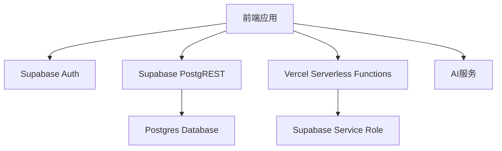
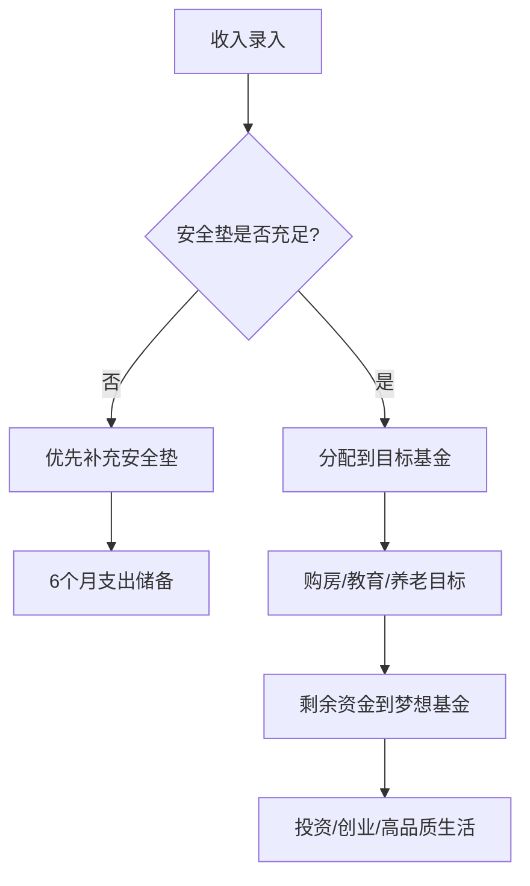

# Family Inc. OS - 代码维基

## 1. 项目概览

Family Inc. OS 是一个将家庭视为"无限公司"的综合性管理平台，通过企业级管理思维运营家庭，结合AI辅助决策，实现家庭资源的优化配置和代际跃迁。

### 核心价值
- **系统性管理**：统一管理平台，覆盖家庭所有核心领域
- **AI智能决策**：基于数据的个性化建议和预测
- **代际规划**：从个人到家庭的长期发展路径
- **资源整合**：优化配置家庭内外部资源
- **目标达成**：可量化的家庭进步指标

### 技术栈
- **前端**：React 18 + TypeScript + Vite + Tailwind CSS
- **数据缓存**：TanStack Query
- **状态管理**：Zustand
- **路由**：React Router
- **后端**：Supabase (Auth + Postgres + RLS)
- **部署**：Vercel

## 2. 项目架构

### 2.1 整体架构



### 2.2 关键边界
- **前端（SPA）**：路由、页面渲染、表单交互、React Query 缓存、调用 Supabase（`from/rpc/auth`）
- **Supabase**：Auth、Postgres、RLS（授权兜底）、RPC/Trigger（原子业务操作）
- **Vercel Serverless**：少量后端动作（例如删除 Auth 用户），负责安全地使用 service role

### 2.3 目录结构

```
├── api/             # Vercel Serverless Functions
│   ├── _lib/        # 共享库
│   ├── account/     # 账号相关API
│   └── ai/          # AI相关API
├── src/             # 前端源代码
│   ├── components/  # UI组件
│   ├── contexts/    # React Context
│   ├── hooks/       # 自定义Hooks
│   ├── layouts/     # 页面布局
│   ├── lib/         # 工具库
│   ├── pages/       # 页面组件
│   ├── stores/      # Zustand状态管理
│   └── types/       # TypeScript类型定义
├── supabase/        # Supabase数据库迁移
└── docs/            # 项目文档
```

## 3. 核心模块

### 3.1 认证与用户管理

**主要功能**：用户登录、注册、会话管理、家庭创建与加入

**关键文件**：
- [AuthContext.tsx](file:///workspace/src/contexts/AuthContext.tsx) - 认证状态管理
- [ProtectedRoute.tsx](file:///workspace/src/components/ProtectedRoute.tsx) - 登录守卫
- [RequireFamilyRoute.tsx](file:///workspace/src/components/RequireFamilyRoute.tsx) - 家庭成员守卫
- [useProfile.ts](file:///workspace/src/hooks/useProfile.ts) - 用户资料获取
- [Setup.tsx](file:///workspace/src/pages/family/Setup.tsx) - 家庭创建/加入
- [JoinFamily.tsx](file:///workspace/src/pages/JoinFamily.tsx) - 邀请加入家庭

**数据访问**：
- Supabase Auth API
- `users` 表（通过 RLS 限制只能访问自己的数据）
- `invitations` 表（邀请管理）

### 3.2 财务模块

**主要功能**：记账、预算管理、分类管理、固定支出、资产负债表

**关键文件**：
- [Transactions.tsx](file:///workspace/src/pages/finance/Transactions.tsx) - 交易记录页面
- [useTransactions.ts](file:///workspace/src/hooks/useTransactions.ts) - 交易数据获取与操作
- [Categories.tsx](file:///workspace/src/pages/finance/Categories.tsx) - 分类管理页面
- [useCategories.ts](file:///workspace/src/hooks/useCategories.ts) - 分类数据管理
- [Budgets.tsx](file:///workspace/src/pages/finance/Budgets.tsx) - 预算管理页面
- [useBudgets.ts](file:///workspace/src/hooks/useBudgets.ts) - 预算数据管理
- [Recurring.tsx](file:///workspace/src/pages/finance/Recurring.tsx) - 固定支出管理
- [useRecurringTransactions.ts](file:///workspace/src/hooks/useRecurringTransactions.ts) - 固定支出数据管理
- [Assets.tsx](file:///workspace/src/pages/finance/Assets.tsx) - 资产负债表页面
- [useBalanceSheet.ts](file:///workspace/src/hooks/useBalanceSheet.ts) - 资产负债数据管理

**数据访问**：
- `transactions` 表（交易记录）
- `categories` 表（分类）
- `budgets` 表（预算）
- `recurring_transactions` 表（固定支出）
- `balance_sheet_items` 表（资产负债项）
- `fund_accounts` 表（基金账户）

### 3.3 健康模块

**主要功能**：健康档案管理、健康指标追踪、保险管理

**关键文件**：
- [useHealthProfile.ts](file:///workspace/src/hooks/useHealthProfile.ts) - 健康档案管理
- [useHealthMetrics.ts](file:///workspace/src/hooks/useHealthMetrics.ts) - 健康指标管理
- [useInsurancePolicies.ts](file:///workspace/src/hooks/useInsurancePolicies.ts) - 保险管理

**数据访问**：
- `health_profiles` 表（健康档案）
- `health_metrics` 表（健康指标）
- `insurance_policies` 表（保险单）

### 3.4 关系模块

**主要功能**：家庭关系管理、事件记录、外部联系人管理

**关键文件**：
- [useRelationshipEvents.ts](file:///workspace/src/hooks/useRelationshipEvents.ts) - 关系事件管理
- [useExternalContacts.ts](file:///workspace/src/hooks/useExternalContacts.ts) - 外部联系人管理
- [useContactInteractions.ts](file:///workspace/src/hooks/useContactInteractions.ts) - 联系互动记录
- [useMemberRemarks.ts](file:///workspace/src/hooks/useMemberRemarks.ts) - 成员备注管理

**数据访问**：
- `relationship_events` 表（关系事件）
- `external_contacts` 表（外部联系人）
- `contact_interactions` 表（联系互动）
- `family_member_remarks` 表（成员备注）

### 3.5 AI模块

**主要功能**：AI辅助决策、智能分析、对话式交互

**关键文件**：
- [copilot-panel.tsx](file:///workspace/src/components/ai/copilot-panel.tsx) - AI助手面板
- [client.ts](file:///workspace/src/lib/ai/client.ts) - AI客户端
- [chat.ts](file:///workspace/api/ai/chat.ts) - AI聊天API

**数据访问**：
- OpenAI API
- 项目内各类数据（通过前端传递）

## 4. 关键类与函数

### 4.1 认证与用户管理

#### AuthContext.tsx
- **功能**：管理用户认证状态，提供登录、注册、登出等方法
- **核心函数**：
  - `signInWithPassword` - 密码登录
  - `signUp` - 注册新用户
  - `signOut` - 登出
  - `getSession` - 获取当前会话

#### useProfile.ts
- **功能**：获取和管理用户资料
- **核心函数**：
  - `getProfile` - 获取用户资料
  - `updateProfile` - 更新用户资料

### 4.2 财务模块

#### useTransactions.ts
- **功能**：管理交易记录
- **核心函数**：
  - `getTransactions` - 获取交易记录（支持过滤和分页）
  - `createTransaction` - 创建交易记录
  - `updateTransaction` - 更新交易记录
  - `deleteTransaction` - 删除交易记录

#### useBudgets.ts
- **功能**：管理预算
- **核心函数**：
  - `getBudgets` - 获取预算
  - `updateBudget` - 更新预算
  - `ensureMonthBudgets` - 确保月度预算存在

#### useRecurringTransactions.ts
- **功能**：管理固定支出
- **核心函数**：
  - `getRecurringTransactions` - 获取固定支出
  - `createRecurringTransaction` - 创建固定支出
  - `updateRecurringTransaction` - 更新固定支出
  - `deleteRecurringTransaction` - 删除固定支出
  - `generateRecurringTransaction` - 生成周期性交易记录

### 4.3 健康与关系模块

#### useHealthProfile.ts
- **功能**：管理健康档案
- **核心函数**：
  - `getHealthProfile` - 获取健康档案
  - `updateHealthProfile` - 更新健康档案

#### useRelationshipEvents.ts
- **功能**：管理关系事件
- **核心函数**：
  - `getRelationshipEvents` - 获取关系事件
  - `createRelationshipEvent` - 创建关系事件
  - `updateRelationshipEvent` - 更新关系事件
  - `deleteRelationshipEvent` - 删除关系事件

### 4.4 AI模块

#### client.ts
- **功能**：AI服务客户端
- **核心函数**：
  - `chat` - 与AI进行对话
  - `analyzeData` - 分析数据

#### chat.ts
- **功能**：AI聊天API
- **核心函数**：
  - 处理前端发送的聊天请求
  - 调用OpenAI API
  - 返回AI响应

## 5. 依赖关系

### 5.1 前端依赖

| 依赖 | 版本 | 用途 |
|------|------|------|
| react | ^18.3.1 | 前端框架 |
| react-dom | ^18.3.1 | DOM操作 |
| react-router-dom | ^7.3.0 | 路由管理 |
| @tanstack/react-query | ^5.90.20 | 数据缓存与请求管理 |
| zustand | ^5.0.3 | 状态管理 |
| @supabase/supabase-js | ^2.95.0 | Supabase客户端 |
| tailwindcss | ^3.4.17 | CSS框架 |
| date-fns | ^4.1.0 | 日期处理 |
| recharts | ^3.7.0 | 图表库 |
| zod | ^4.3.6 | 数据验证 |
| lucide-react | ^0.511.0 | 图标库 |
| workbox-window | ^7.0.0 | PWA支持 |

### 5.2 后端依赖

| 依赖 | 用途 |
|------|------|
| Supabase Auth | 用户认证 |
| Supabase Postgres | 数据库 |
| Vercel Serverless Functions | 后端API |
| OpenAI API | AI服务 |

## 6. 项目运行方式

### 6.1 开发环境

1. **安装依赖**
   ```bash
   pnpm install
   ```

2. **配置环境变量**
   - 复制 `.env.example` 为 `.env`
   - 填写 `VITE_SUPABASE_URL` 和 `VITE_SUPABASE_ANON_KEY`

3. **启动开发服务器**
   ```bash
   pnpm dev
   ```

4. **构建项目**
   ```bash
   pnpm build
   ```

### 6.2 部署

- **Vercel部署**：
  1. 连接GitHub仓库到Vercel
  2. 配置环境变量（`VITE_SUPABASE_URL`、`VITE_SUPABASE_ANON_KEY`、`SUPABASE_SERVICE_ROLE_KEY`）
  3. 触发自动部署

### 6.3 数据库迁移

- **Supabase迁移**：
  1. 运行迁移文件：`supabase db reset`
  2. 应用新迁移：`supabase db push`

## 7. 核心业务流程

### 7.1 财务规划流程



### 7.2 邀请加入家庭流程

1. 管理员创建邀请链接
2. 被邀请人点击链接
3. 被邀请人登录或注册
4. 系统验证邀请码
5. 被邀请人加入家庭
6. 更新用户资料和权限

### 7.3 固定支出自动生成流程

1. 用户设置固定支出规则
2. 系统定期执行 `generate_recurring_transaction` RPC
3. RPC 检查是否需要生成交易
4. 生成交易记录并写入数据库
5. 前端通过 React Query 自动更新数据

## 8. 安全与权限

### 8.1 认证机制
- 使用 Supabase Auth 进行用户认证
- 前端只持有 anon key，不暴露 service role
- 会话管理由 Supabase 负责

### 8.2 授权机制
- 使用 Supabase RLS (Row Level Security) 进行数据访问控制
- 按家庭隔离数据（通过 `family_id`）
- 支持个人隐私数据（如 `visibility='private'` 的交易）

### 8.3 特权操作
- 需要 service role 的操作（如删除用户）通过 Vercel Serverless Functions 执行
- 使用 bearer token 校验用户身份
- 业务数据清理由 DB RPC 执行

## 9. 监控与维护

### 9.1 错误处理
- 使用 ErrorBoundary 捕获前端错误
- 后端 API 错误处理和日志

### 9.2 性能优化
- React Query 缓存减少重复请求
- 组件懒加载
- PWA 支持离线访问

## 10. 商业化规划

### 10.1 商业模式

#### 1. 订阅制
- **基础版**：免费，包含核心财务功能
- **高级版**：月费/年费，包含AI顾问、高级分析、多家庭管理
- **企业版**：为家族企业提供定制化服务

#### 2. 增值服务
- **金融产品推荐**：与银行、保险公司合作，推荐适合的金融产品，获取佣金
- **教育资源对接**：与教育机构合作，推荐课程和资源，获取佣金
- **健康服务**：与医疗机构合作，提供健康检查、咨询服务
- **专业咨询**：对接财务顾问、教育专家、健康顾问等，提供付费咨询服务

#### 3. 数据变现
- **匿名数据聚合**：在用户同意的情况下，聚合匿名数据，为研究机构、企业提供市场洞察
- **家庭财务健康评分**：基于数据为家庭提供财务健康评分，为金融机构提供风险评估依据

### 10.2 增长策略

#### 1. 用户获取
- **内容营销**：创建家庭财务管理、教育规划、健康管理等相关内容
- **社交媒体**：通过社交媒体分享成功案例和实用工具
- **合作伙伴**：与金融机构、教育机构、医疗机构等合作推广
- **口碑传播**：鼓励用户分享邀请码，提供奖励

#### 2. 用户留存
- **个性化推荐**：基于用户数据提供个性化建议
- **定期报告**：提供家庭财务、健康、教育等定期报告
- **社区建设**：创建用户社区，分享经验和建议
- **客户成功**：提供一对一的客户成功服务

#### 3. 收入增长
- **功能扩展**：不断添加新功能，提高用户粘性
- **定价策略**：根据市场反馈调整定价
- **企业合作**：与企业合作，为员工提供家庭管理福利
- **国际化**：扩展到国际市场，适应不同国家的家庭需求

### 10.3 技术规划

#### 1.  scalability
- **微服务架构**：将核心功能拆分为微服务，提高系统可扩展性
- **容器化部署**：使用 Docker 容器化部署，提高部署效率
- **边缘计算**：使用边缘计算提高响应速度

#### 2. 安全性
- **零知识加密**：对敏感数据进行零知识加密
- **多因素认证**：支持多因素认证，提高账户安全性
- **安全审计**：定期进行安全审计，确保系统安全

#### 3. AI能力
- **个性化模型**：为每个家庭训练个性化的AI模型
- **预测分析**：基于历史数据预测未来趋势
- **自然语言处理**：提高AI与用户的交互能力
- **计算机视觉**：支持账单识别、健康报告分析等功能

### 10.4 风险与应对

#### 1. 技术风险
- **数据安全**：加强数据加密和访问控制
- **系统稳定性**：建立监控系统，及时发现和解决问题
- **技术债务**：定期重构代码，保持技术栈更新

#### 2. 商业风险
- **用户习惯**：通过教育和引导，帮助用户养成使用习惯
- **隐私顾虑**：透明的数据使用政策，获得用户信任
- **竞争激烈**：专注于核心优势，提供差异化服务

#### 3. 合规风险
- **数据保护**：遵守各国家和地区的数据保护法规
- **金融监管**：遵守金融相关法规
- **税务合规**：确保税务处理合规

### 10.5 长期愿景

Family Inc. OS 不仅是一个管理工具，更是家庭发展的操作系统。通过数据驱动的家庭管理，帮助每个家庭实现：

1. **财务安全**：从月光族到财务自由
2. **教育成功**：从应试教育到全面发展
3. **健康幸福**：从疾病治疗到健康管理
4. **关系和谐**：从矛盾冲突到相互成就
5. **代际跃迁**：从底层中产到精英阶层

最终目标是让每个家庭都能像经营优秀企业一样经营自己的生活，实现可持续的家族繁荣。