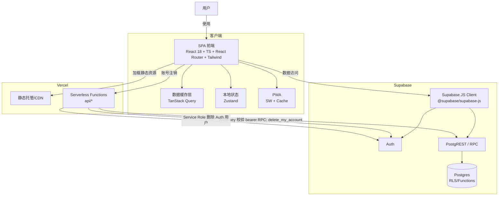

# 当前架构（Containers）

## Container Diagram（C4-like）

## 运行时边界与职责
- SPA：路由/页面渲染、表单与交互、调用 Supabase（from/rpc/auth）、本地缓存与状态
- Supabase：认证会话、数据存储、行级授权（RLS policies）、复杂写入/清理（RPC/trigger）
- Vercel Functions：少量“需要 service role”的后端动作；其余业务尽量由 Supabase RLS/RPC 承担

## 环境变量边界
- 客户端（Vite）：`VITE_SUPABASE_URL`、`VITE_SUPABASE_ANON_KEY`
- Serverless（Vercel）：`SUPABASE_SERVICE_ROLE_KEY`（以及 URL/ANON_KEY 的 server-side 读法）

