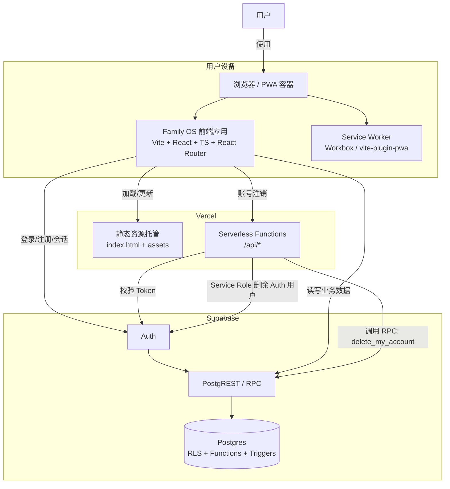

# 当前架构（Context）

## 范围
- 以仓库当前实现为准：Vite + React SPA 直连 Supabase（PostgREST/RPC + RLS），少量 Vercel Serverless API

## System Context（C4-like）

## 关键约束（决定了架构形态）
- 前端直连数据库能力由 Supabase RLS 决定：鉴权在客户端，授权在数据库（policy/function）
- Serverless API 仅承担“必须使用 service role 的动作”（例如删除 Auth 用户）

