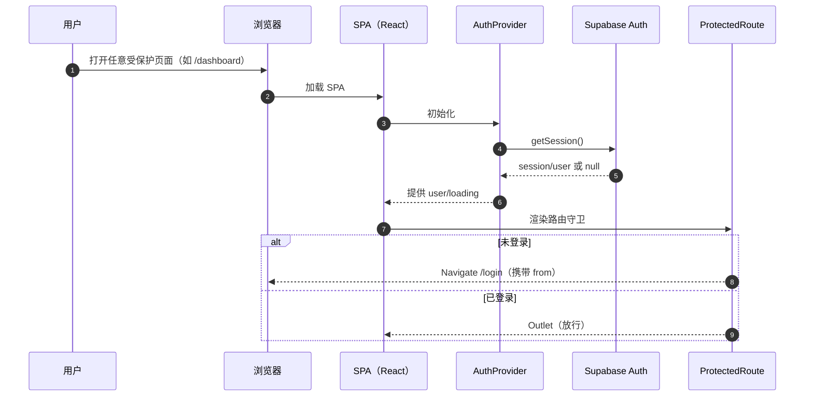
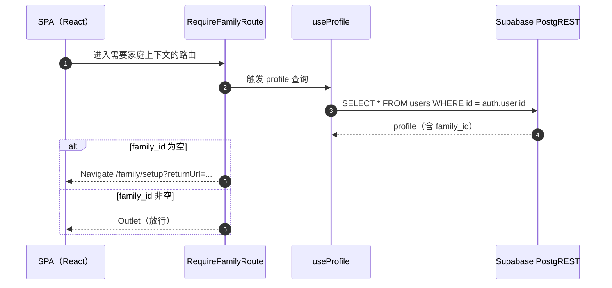

# 动态流（Auth + 路由守卫）

## 登录态与受保护路由

```mermaid
sequenceDiagram
  autonumber
  participant U as 用户
  participant B as 浏览器
  participant A as SPA（React）
  participant AC as AuthProvider
  participant SA as Supabase Auth
  participant PR as ProtectedRoute

  U->>B: 打开任意受保护页面（如 /dashboard）
  B->>A: 加载 SPA
  A->>AC: 初始化
  AC->>SA: getSession()
  SA-->>AC: session/user 或 null
  AC-->>A: 提供 user/loading
  A->>PR: 渲染路由守卫
  alt 未登录
    PR-->>B: Navigate /login（携带 from）
  else 已登录
    PR-->>A: Outlet（放行）
  end
```

## 进一步约束：必须加入家庭

```mermaid
sequenceDiagram
  autonumber
  participant A as SPA（React）
  participant RF as RequireFamilyRoute
  participant HP as useProfile
  participant DB as Supabase PostgREST

  A->>RF: 进入需要家庭上下文的路由
  RF->>HP: 触发 profile 查询
  HP->>DB: SELECT * FROM users WHERE id = auth.user.id
  DB-->>HP: profile（含 family_id）
  alt family_id 为空
    RF-->>A: Navigate /family/setup?returnUrl=...
  else family_id 非空
    RF-->>A: Outlet（放行）
  end
```

