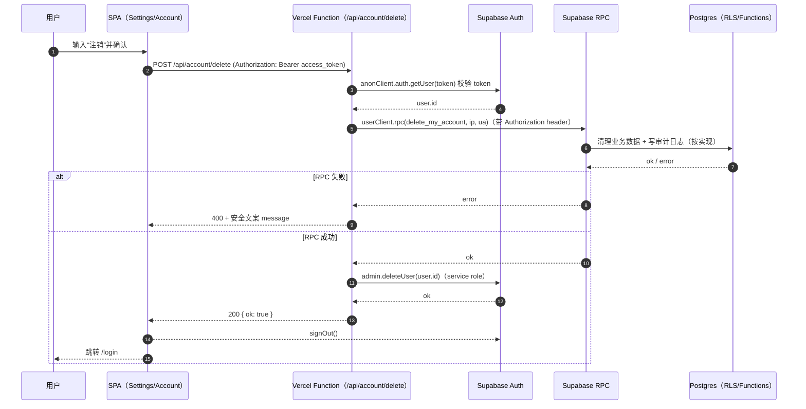

# 动态流（账号注销）

## 从前端到删除 Supabase Auth 用户

```mermaid
sequenceDiagram
  autonumber
  participant U as 用户
  participant A as SPA（Settings/Account）
  participant F as Vercel Function（/api/account/delete）
  participant SA as Supabase Auth
  participant SR as Supabase RPC
  participant DB as Postgres（RLS/Functions）

  U->>A: 输入“注销”并确认
  A->>F: POST /api/account/delete (Authorization: Bearer access_token)
  F->>SA: anonClient.auth.getUser(token) 校验 token
  SA-->>F: user.id
  F->>SR: userClient.rpc(delete_my_account, ip, ua)（带 Authorization header）
  SR->>DB: 清理业务数据 + 写审计日志（按实现）
  DB-->>SR: ok / error
  alt RPC 失败
    SR-->>F: error
    F-->>A: 400 + 安全文案 message
  else RPC 成功
    SR-->>F: ok
    F->>SA: admin.deleteUser(user.id)（service role）
    SA-->>F: ok
    F-->>A: 200 { ok: true }
    A-->>SA: signOut()
    A-->>U: 跳转 /login
  end
```

## 关键边界
- 前端只持有 anon key（公开），不能直接删除 Auth 用户
- `/api/account/delete` 通过 service role 执行“删除 Auth 用户”这一特权动作，并保证错误信息不泄漏内部细节

