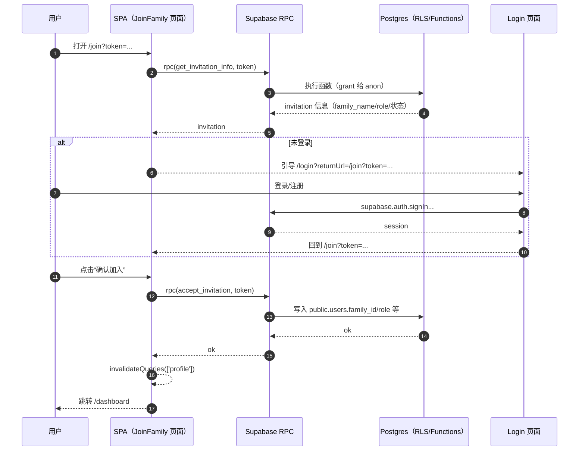

# 动态流（邀请加入家庭）

## 从邀请链接到加入成功

```mermaid
sequenceDiagram
  autonumber
  participant U as 用户
  participant A as SPA（JoinFamily 页面）
  participant S as Supabase RPC
  participant DB as Postgres（RLS/Functions）
  participant L as Login 页面

  U->>A: 打开 /join?token=...
  A->>S: rpc(get_invitation_info, token)
  S->>DB: 执行函数（grant 给 anon）
  DB-->>S: invitation 信息（family_name/role/状态）
  S-->>A: invitation

  alt 未登录
    A-->>L: 引导 /login?returnUrl=/join?token=...
    U->>L: 登录/注册
    L->>S: supabase.auth.signIn...
    S-->>L: session
    L-->>A: 回到 /join?token=...
  end

  U->>A: 点击“确认加入”
  A->>S: rpc(accept_invitation, token)
  S->>DB: 写入 public.users.family_id/role 等
  DB-->>S: ok
  S-->>A: ok
  A-->>A: invalidateQueries(['profile'])
  A-->>U: 跳转 /dashboard
```

## 关键权限点
- `get_invitation_info` 允许匿名调用，但必须校验 token 状态/过期
- `accept_invitation` 必须在登录态下执行；写入 `users.family_id` 由函数在 DB 侧完成并受约束

