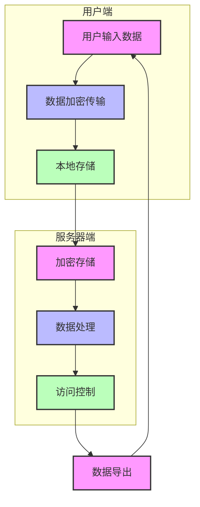
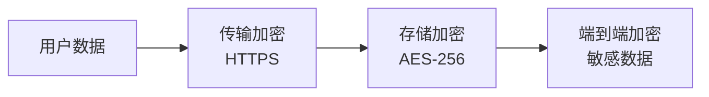
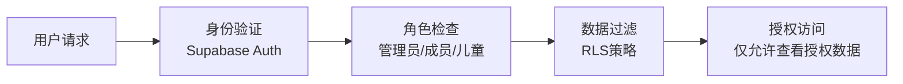
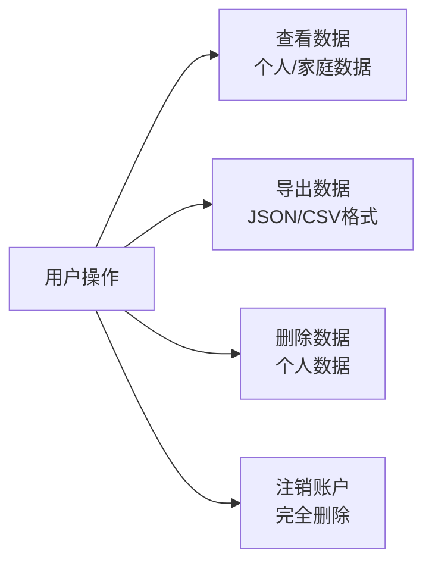
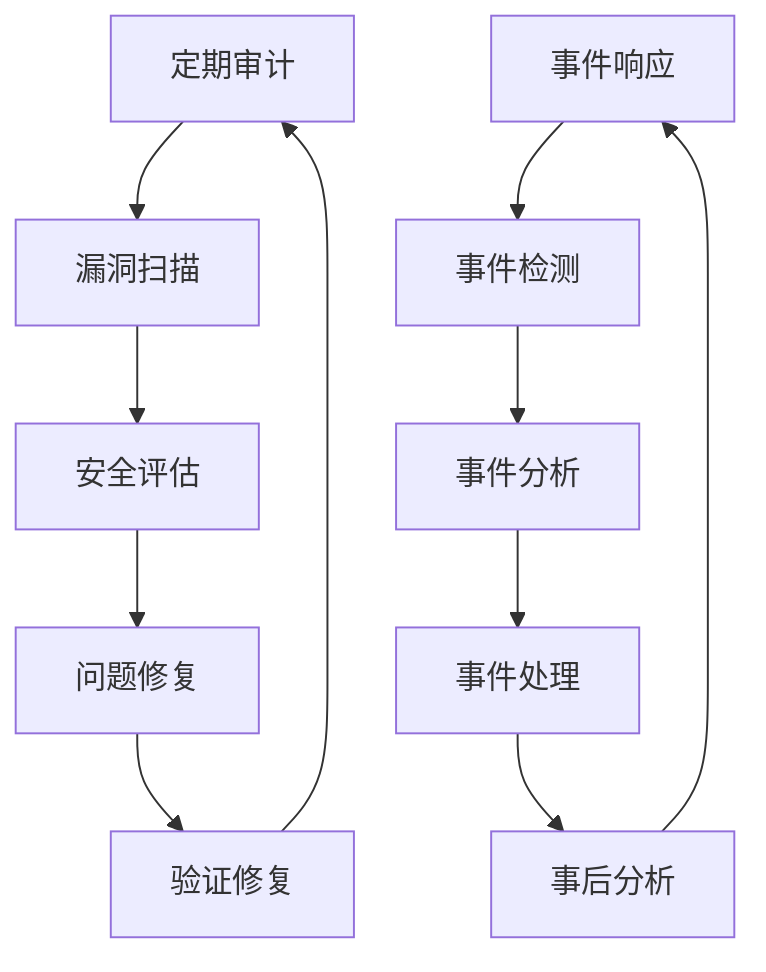
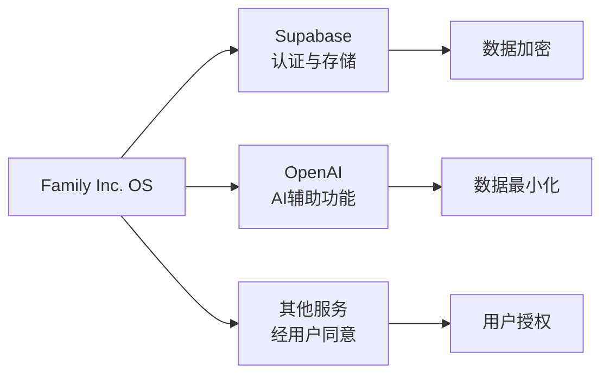
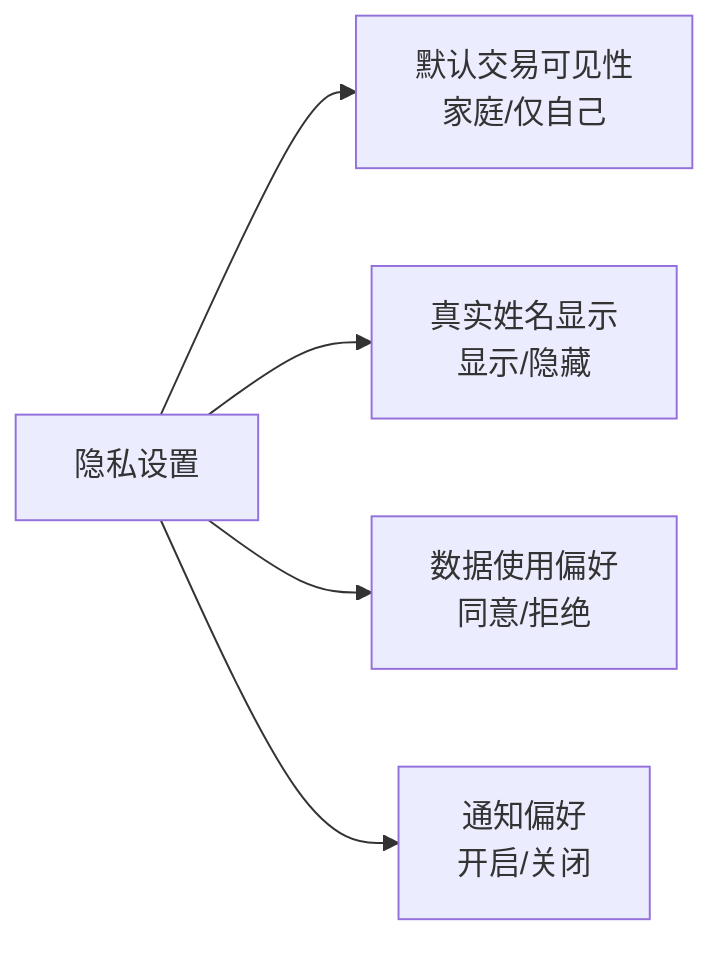
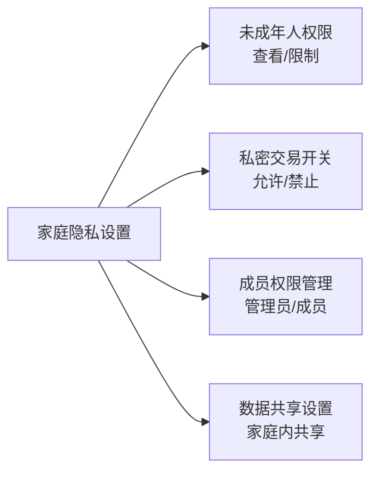

# 隐私政策视觉化版本

## 数据流程可视化



## 数据分级保护

| 级别 | 数据类型 | 保护措施 | 可视化表示 |
|------|---------|---------|------------|
| P0 | 财务数据、健康记录、家庭矛盾 | 端到端加密、严格访问控制、最小化存储 | 🛡️ 最高保护 |
| P1 | 邮箱、姓名、家庭名称 | 传输加密、存储加密、访问控制 | 🔒 中等保护 |
| P2 | 主题偏好、语言设置 | 基本加密、存储安全 | 🔐 基础保护 |

## 权限控制矩阵

```mermaid
table
  | 功能 | 管理员 | 普通成员 | 未成年人 |
  |------|--------|----------|----------|
  | 查看家庭交易 | ✅ | ✅ | ❌ |
  | 查看私密交易 | 仅自己 | 仅自己 | 仅自己 |
  | 创建交易 | ✅ | ✅ | ✅ (可限制) |
  | 修改交易 | ✅ | 仅自己 | 仅自己 |
  | 邀请成员 | ✅ | ❌ | ❌ |
  | 修改家庭设置 | ✅ | ❌ | ❌ |
```

## 隐私保护措施

### 1. 数据加密



### 2. 访问控制



### 3. 数据控制



## 数据生命周期

```mermaid
gantt
    title 数据生命周期
    dateFormat  YYYY-MM-DD
    section 数据收集
    用户输入 :active, 2024-01-01, 1d
    自动收集 :active, after 用户输入, 1d
    
    section 数据存储
    加密存储 :active, after 自动收集, 365d
    定期备份 :active, after 加密存储, 7d
    
    section 数据使用
    业务功能 :active, after 加密存储, 365d
    数据分析 :active, after 业务功能, 365d
    
    section 数据删除
    用户删除 :active, 2025-01-01, 1d
    账户注销 :active, after 用户删除, 1d
    数据清理 :active, after 账户注销, 7d
```

## 安全审计流程



## 合规性

| 法规 | 状态 | 覆盖范围 |
|------|------|----------|
| GDPR | ✅ 已合规 | 数据保护、用户权利 |
| CCPA | ✅ 已合规 | 数据透明度、选择退出 |
| 儿童隐私 | ✅ 已合规 | 未成年人数据保护 |
| 金融数据 | ✅ 已合规 | 财务数据安全 |

## 用户权利

```mermaid
table
  | 权利 | 描述 | 操作方式 |
  |------|------|----------|
  | 访问权 | 查看您的所有数据 | 数据管理页面 |
  | 导出权 | 导出数据为JSON/CSV | 数据管理页面 |
  | 删除权 | 删除您的个人数据 | 账户设置页面 |
  | 知情权 | 了解数据使用情况 | 隐私政策页面 |
  | 控制权 | 管理隐私设置 | 隐私设置页面 |
```

## 第三方服务



## 隐私设置

### 个人隐私设置



### 家庭隐私设置



## 紧急联系

如果您有任何隐私相关问题，请通过以下方式联系我们：

- 邮箱：privacy@familyincos.com
- 产品内：设置 > 信任中心 > 联系我们
- 电话：[电话号码]
- 地址：[公司地址]

## 隐私政策更新

我们会定期更新隐私政策，以反映新的功能和法规要求。重要更新会通过以下方式通知您：

- 电子邮件通知
- 产品内通知
- 隐私政策页面的更新记录

您可以在隐私政策页面查看所有历史版本。