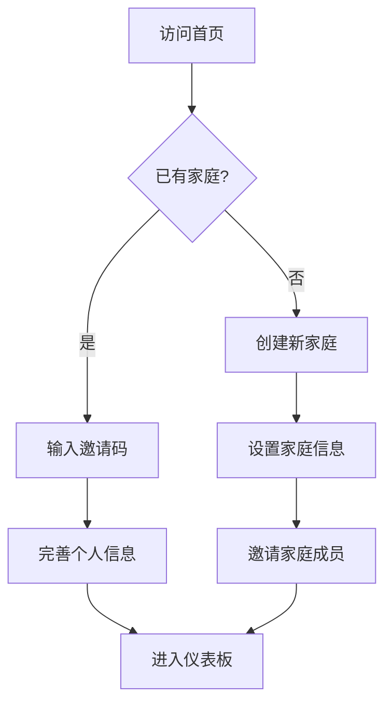
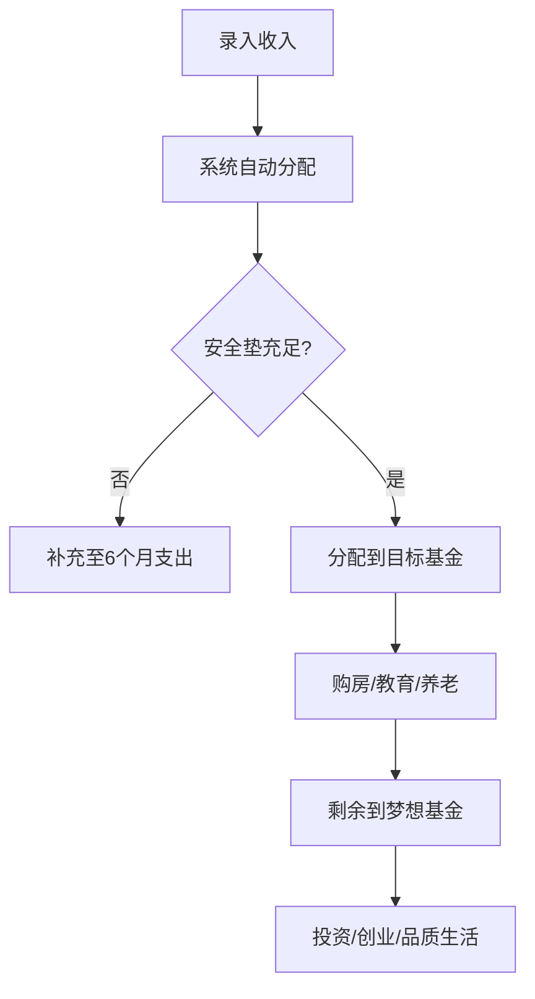
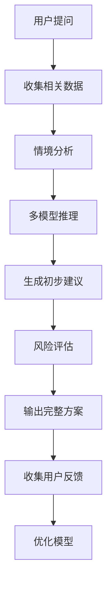

# Family Inc. OS - 产品需求文档

## 1. 产品概述

Family Inc. OS是一个将家庭视为"无限公司"进行系统化管理的智能平台。通过AI辅助决策，整合财务规划、教育成长、健康管理、关系维护等核心模块，帮助家庭实现代际跃迁和可持续发展。

**目标用户**: 30-45岁中产家庭，有子女教育、财务规划、职业发展等综合需求的家庭决策者。

**核心价值**: 用企业级管理思维运营家庭，通过数据驱动实现家庭资源的优化配置和长期繁荣。

## 2. 核心功能

### 2.1 用户角色

| 角色 | 注册方式 | 核心权限 |
|------|----------|----------|
| 家庭CEO | 手机号+邮箱注册 | 完整家庭管理权限，包括财务、成员、目标设定 |
| 家庭CFO | CEO邀请加入 | 财务管理权限，查看和编辑财务数据 |
| 家庭成员 | CEO邀请加入 | 查看个人相关数据，录入个人信息 |
| 访客用户 | 临时访问 | 仅查看demo数据，无操作权限 |

### 2.2 功能模块

**核心页面列表**:
1. **家庭仪表板**: 家庭整体状况概览，关键指标展示
2. **财务中心**: 记账、预算、资产、投资、保险管理
3. **成长规划**: 教育OKR、职业规划、技能发展
4. **健康中心**: 健康档案、保险地图、健康计划
5. **关系管理**: 家庭CRM、事件日历、情感银行
6. **AI顾问**: 智能分析、决策支持、策略建议
7. **知识库**: 家庭经验沉淀、最佳实践、案例库

### 2.3 页面详细规格

| 页面名称 | 模块名称 | 功能描述 |
|----------|----------|----------|
| 家庭仪表板 | 关键指标 | 显示家庭财务健康度、目标完成度、成员状态等核心KPI |
| 家庭仪表板 | 待办事项 | 展示近期重要任务、缴费提醒、事件安排 |
| 家庭仪表板 | 趋势分析 | 财务、健康、教育等关键指标的变化趋势 |
| 财务中心 | 智能记账 | AI自动识别支出类别，支持语音、拍照、手动录入 |
| 财务中心 | 预算管理 | 按类别设定预算，实时监控支出进度 |
| 财务中心 | 资产配置 | 可视化展示各类资产分布，计算收益率 |
| 财务中心 | 3层基金 | 实现安全垫→目标基金→梦想基金的自动分配 |
| 财务中心 | 投资规划 | 基于风险承受能力的投资组合推荐 |
| 成长规划 | 教育OKR | 为孩子设定学习目标，跟踪能力发展 |
| 成长规划 | 职业规划 | 家长职业技能评估，发展路径规划 |
| 成长规划 | 资源推荐 | 基于家庭情况的教育和职业机会推荐 |
| 健康中心 | 健康档案 | 管理体检报告、疫苗记录、病史信息 |
| 健康中心 | 保险地图 | 可视化展示各类保险覆盖范围和缺口 |
| 健康中心 | 健康计划 | 个性化运动、饮食、睡眠建议 |
| 关系管理 | 家庭CRM | 记录重要日期、维护亲情关系 |
| 关系管理 | 情感银行 | 量化和追踪家庭成员间的情感投入 |
| 关系管理 | 冲突管理 | 记录家庭矛盾，提供解决方案建议 |
| AI顾问 | 家庭诊断 | 基于数据的全面家庭状况评估 |
| AI顾问 | 决策支持 | 重大决策的利弊分析和时机判断 |
| AI顾问 | 预测分析 | 预测家庭发展趋势和潜在风险 |

## 3. 核心流程

### 3.1 新用户注册流程

### 3.2 财务规划流程

### 3.3 AI决策流程

## 4. 用户界面设计

### 4.1 设计规范

**色彩方案**:
- 主色: #2563EB (蓝色，代表信任和专业)
- 辅助色: #10B981 (绿色，代表增长和健康)
- 警告色: #F59E0B (橙色，代表提醒)
- 错误色: #EF4444 (红色，代表危险)
- 中性色: #6B7280 (灰色，用于文字和边框)

**字体系统**:
- 标题: Inter Bold, 24-32px
- 正文: Inter Regular, 14-16px
- 数字: Roboto Mono, 12-14px

**组件风格**:
- 圆角: 8px标准圆角
- 阴影: 轻微阴影增加层次感
- 动画: 200ms缓动过渡
- 图标: Heroicons线性图标

### 4.2 页面布局

**仪表板布局**:
- 顶部导航: Logo、家庭名称、用户菜单
- 侧边栏: 主要功能导航
- 主内容区: 卡片式布局，2-3列网格
- 右侧边栏: 快速操作和提醒

**表单设计**:
- 单列布局，减少认知负担
- 实时验证，即时反馈
- 分组组织，逻辑清晰
- 保存提示，防止数据丢失

### 4.3 数据可视化

**图表类型**:
- 饼图: 资产分布、支出类别
- 折线图: 趋势变化、时间序列
- 柱状图: 对比分析、进度展示
- 仪表盘: 关键指标、健康度

**交互设计**:
- 悬停显示详细数据
- 点击钻取到详细页面
- 支持时间范围选择
- 导出图表功能

### 4.4 响应式设计

**断点设置**:
- 移动端: < 768px
- 平板: 768px - 1024px
- 桌面: > 1024px

**适配策略**:
- 移动端优先，核心功能突出
- 平板端优化，充分利用屏幕空间
- 桌面端增强，展示更多数据

## 5. 技术架构

### 5.1 前端架构

**技术栈**:
- Next.js 14 (App Router)
- TypeScript 5.x
- Tailwind CSS 3.x
- React Hook Form
- TanStack Query
- Recharts (数据可视化)
- Framer Motion (动画)

**架构特点**:
- 服务端渲染，提升首屏性能
- 类型安全，减少运行时错误
- 组件化开发，提高复用性
- 状态管理，数据流清晰

### 5.2 后端架构

**核心服务**:
- Supabase (数据库、认证、存储)
- Vercel Edge Functions (API端点)
- Vercel AI SDK (AI功能)
- OpenAI GPT-4 (大语言模型)

**数据处理**:
- 实时数据同步
- 边缘计算优化
- 缓存策略设计
- 安全防护措施

### 5.3 AI集成

**功能模块**:
- 自然语言处理: 理解用户意图
- 数据分析: 挖掘数据洞察
- 预测模型: 趋势预测和风险评估
- 推荐系统: 个性化建议

**实现方式**:
- 提示工程优化
- 上下文管理
- 多模型组合
- 持续学习机制

## 6. 数据安全与隐私

### 6.1 安全措施

**数据传输**:
- HTTPS加密传输
- API请求签名验证
- 敏感数据脱敏处理

**数据存储**:
- 数据库加密存储
- 访问权限控制
- 定期安全审计

**用户隐私**:
- 数据最小化原则
- 用户授权机制
- 数据删除权利
- 隐私政策透明

### 6.2 合规要求

**法规遵循**:
- GDPR合规设计
- 数据本地化要求
- 儿童隐私保护
- 金融监管要求

## 7. 性能要求

### 7.1 性能指标

**加载性能**:
- 首屏加载 < 2秒
- 交互响应 < 100ms
- 数据查询 < 500ms

**稳定性要求**:
- 服务可用性 > 99.9%
- 错误率 < 0.1%
- 数据一致性保证

### 7.2 优化策略

**前端优化**:
- 代码分割和懒加载
- 图片压缩和CDN
- 缓存策略优化
- 服务端渲染

**后端优化**:
- 数据库索引优化
- API响应缓存
- 并发处理优化
- 负载均衡设计

## 8. 测试策略

### 8.1 测试类型

**单元测试**:
- 核心算法逻辑
- 数据处理函数
- 工具函数验证

**集成测试**:
- API接口测试
- 数据库操作
- 第三方服务集成

**端到端测试**:
- 关键用户流程
- 跨页面交互
- 异常情况处理

### 8.2 测试工具

**测试框架**:
- Jest (单元测试)
- React Testing Library (组件测试)
- Playwright (E2E测试)
- MSW (API模拟)

## 9. 部署与运维

### 9.1 部署方案

**基础设施**:
- Vercel (前端托管)
- Supabase (后端服务)
- Cloudflare (CDN加速)
- Sentry (错误监控)

**部署流程**:
- 持续集成/持续部署
- 自动化测试验证
- 灰度发布机制
- 快速回滚能力

### 9.2 监控告警

**性能监控**:
- 前端性能指标
- API响应时间
- 数据库性能
- 用户体验指标

**业务监控**:
- 关键功能使用
- 用户行为分析
- 业务指标追踪
- 异常模式识别

## 10. 项目里程碑

### 10.1 开发计划

**第1阶段 (4周)**: 基础架构和核心功能
- 用户系统和权限管理
- 基础财务记账功能
- 仪表板开发

**第2阶段 (6周)**: 财务模块完善
- 预算管理系统
- 资产配置功能
- 报表和分析

**第3阶段 (6周)**: 成长和健康模块
- 教育OKR系统
- 健康档案管理
- AI基础功能

**第4阶段 (4周)**: 关系管理和优化
- 家庭CRM功能
- 关系评估工具
- 性能优化

### 10.2 交付标准

**功能完整性**: 所有核心功能按规格实现
**代码质量**: 测试覆盖率 > 80%
**性能达标**: 满足性能指标要求
**安全合规**: 通过安全审计和隐私评估
**用户体验**: 完成可用性测试，满意度 > 85%

这个PRD文档为Family Inc. OS提供了详细的产品规格说明，涵盖了功能需求、技术架构、设计要求等各个方面，为开发团队提供了清晰的指导。