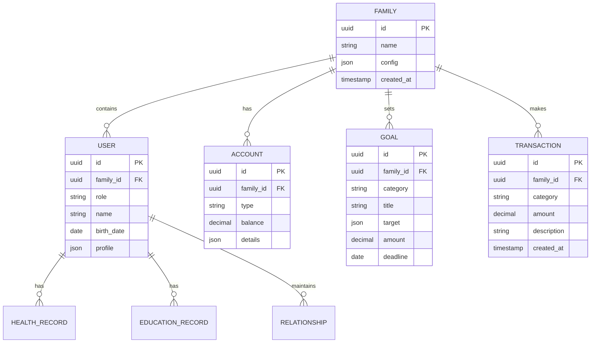
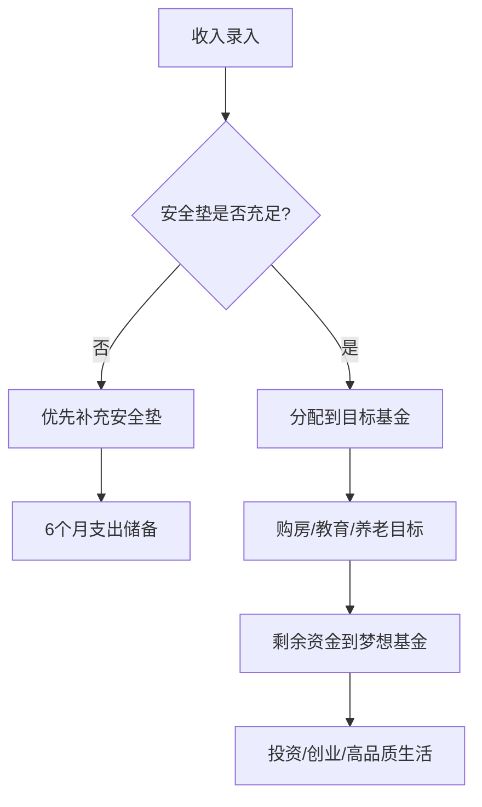
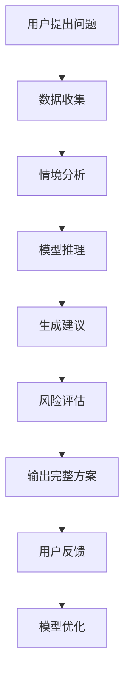

# Family Inc. OS - 家庭无限公司操作系统

## 产品愿景

**背景**: 现代家庭面临多重挑战：财务压力、子女教育、职业发展、健康管理、人际关系等。传统家庭管理方式碎片化，缺乏系统性规划工具。

**约束**: 
- 家庭资源有限（时间、金钱、精力）
- 决策复杂度高（涉及多个家庭成员）
- 需要长期规划与短期执行并重
- 跨代际管理难度大

**解决方案**: 将家庭视为一个"无限公司"，用企业级管理思维运营家庭，通过AI辅助决策，实现家庭资源的优化配置和代际跃迁。

## 核心价值主张

1. **系统性管理**: 统一管理平台，覆盖家庭所有核心领域
2. **AI智能决策**: 基于数据的个性化建议和预测
3. **代际规划**: 从个人到家庭的长期发展路径
4. **资源整合**: 优化配置家庭内外部资源
5. **目标达成**: 可量化的家庭进步指标

## 用户故事

### 家庭CEO（家长）
- 作为家庭CEO，我希望看到家庭的整体"财务报表"，了解资产配置和现金流状况
- 我希望为家庭设定5年、10年、20年的发展目标，并跟踪进度
- 我需要AI顾问帮助我做出买房、投资、教育等重大决策
- 我想要管理家庭成员的角色分工，确保每个人都在为家庭目标贡献力量

### 家庭CFO（财务负责人）
- 我需要按照3层基金结构管理家庭资金（安全垫/目标基金/梦想基金）
- 我想要追踪所有支出，分析消费模式，找到节省空间
- 我希望获得投资建议，平衡风险和收益
- 我需要规划保险配置，确保家庭财务安全

### 家庭HR（教育/关系管理者）
- 我要为孩子制定教育OKR，跟踪学习进度
- 我想要记录和管理家庭重要事件，维护亲情关系
- 我需要关注家庭成员的心理健康状态
- 我希望协调夫妻关系、亲子关系、隔代关系

### 家庭COO（运营负责人）
- 我要管理家庭的健康管理，包括体检、疫苗、运动计划
- 我需要安排家庭日程，协调各方时间
- 我想要建立家庭知识库，沉淀经验教训
- 我要确保家庭运营的各项流程标准化

## 核心模块设计

### 1. 财务模块 (CFO Dashboard)

基于ChatGPT对话中的深圳家庭案例，实现3层基金结构：

```
收入 → 安全垫(6个月) → 目标基金(房子/教育) → 梦想基金(创业/投资)
```

**核心功能**:
- 智能记账：AI自动分类支出，识别异常消费
- 资产配置：可视化展示资产分布，风险评估
- 目标规划：设定购房、教育、退休等目标，自动计算所需资金
- 投资建议：基于家庭风险承受能力的个性化投资组合
- 保险管理：保障缺口分析，产品对比

**技术特色**:
- 集成银行API，自动同步交易记录
- ML模型预测未来现金流
- 情景模拟：失业、疾病、市场波动对家庭财务的影响

### 2. 成长模块 (Growth OKR)

**教育规划**:
- 子女教育路线图：从幼儿园到大学的完整规划
- 能力评估：定期评估孩子在各个领域的发展
- 资源推荐：基于孩子特点的教育资源和机会
- 教育基金：计算教育成本，制定储蓄计划

**职业发展**:
- 家长职业规划：技能提升路径，行业趋势分析
- 副业探索：基于家庭资源和技能的副业建议
- 人脉管理：职业关系网络维护
- 收入优化：薪资谈判策略，职业转换规划

### 3. 健康模块 (Vitality Center)

**健康管理**:
- 家庭健康档案：疫苗记录、体检报告、病史管理
- 保险地图：各类保险覆盖范围可视化
- 健康计划：运动、饮食、睡眠的个性化建议
- 预警系统：基于数据的健康风险提醒

**心理健康**:
- 情绪追踪：家庭成员心理状态监测
- 关系评估：夫妻、亲子关系的定期评估
- 压力管理：识别压力源，提供缓解方案
- 家庭治疗：专业资源的连接和预约

### 4. 关系模块 (Family CRM)

**关系管理**:
- 家庭事件日历：生日、纪念日、重要活动
- 情感银行：记录和追踪家庭成员间的情感投入
- 沟通记录：重要对话的要点和后续行动
- 冲突管理：家庭矛盾的记录和解决方案

**代际协调**:
- 隔代教育：祖辈参与教育的协调机制
- 价值观传承：家庭核心价值观的定义和传播
- 家庭会议：定期家庭会议的议程和决议追踪
- 角色分工：家庭成员的责任和权利界定

### 5. AI顾问模块 (Chief Strategy Officer)

**智能分析**:
- 家庭诊断：基于数据的全面家庭健康评估
- 趋势预测：识别家庭发展中的机会和威胁
- 对标分析：与同类家庭的比较和差距分析
- 策略建议：个性化的家庭发展策略

**决策支持**:
- 重大决策模拟：买房、换工作、移民等决策的利弊分析
- 时机判断：基于数据和趋势的最佳行动时机
- 风险评估：识别潜在风险，制定应对预案
- 资源整合：发现未被充分利用的家庭资源

## 技术架构

### 整体架构

```
前端 (Next.js App Router + TypeScript + Tailwind CSS)
    ↓
API层 (Vercel Edge Functions)
    ↓
业务逻辑层 (Supabase Edge Functions)
    ↓
数据层 (Supabase PostgreSQL)
    ↓
AI服务层 (Vercel AI SDK + OpenAI GPT-4)
```

### 技术选型说明

**背景**: 家庭管理应用需要处理敏感的个人数据，要求高安全性、实时性和可扩展性。

**约束**:
- 需要快速开发和迭代
- 数据安全性和隐私保护要求高
- 需要支持复杂的关系型数据
- AI功能集成需要稳定和高效

**解决方案**:
- **Next.js App Router**: 支持服务端渲染，SEO友好，性能优异
- **TypeScript**: 类型安全，减少运行时错误
- **Tailwind CSS**: 快速UI开发，一致的设计系统
- **Supabase**: 完整的后端解决方案，内置认证、数据库、存储
- **Vercel AI SDK**: 简化AI功能集成，支持流式响应

### 数据模型



### 核心功能流程

1. **财务规划流程**


2. **AI决策流程**


## 产品路线图

### Phase 1 (MVP) - 3个月
- 核心财务模块：记账、预算、基础报表
- 用户系统：家庭创建、成员管理
- 基础AI：支出分类、简单建议

### Phase 2 - 6个月
- 完整财务规划：3层基金、目标设定
- 成长模块：教育规划、OKR管理
- 健康模块：档案管理、保险追踪
- 高级AI：个性化建议、预测分析

### Phase 3 - 12个月
- 关系模块：CRM功能、代际协调
- AI顾问：决策支持、策略规划
- 社区功能：家庭间经验分享
- 专业服务连接：金融、教育、医疗

## 成功指标

### 用户指标
- 月活跃用户(MAU) > 10万
- 用户留存率(7日) > 40%
- 家庭目标达成率 > 60%
- 用户满意度(NPS) > 50

### 业务指标
- 家庭财务健康度提升 > 30%
- 教育投资回报率提升 > 20%
- 家庭关系满意度提升 > 25%
- 重大决策成功率 > 80%

## 风险与挑战

### 技术风险
- **数据安全**: 家庭数据极其敏感，需要最高级别的安全保护
- **AI准确性**: 错误的建议可能导致严重后果
- **系统集成**: 与银行、保险、教育机构的数据集成复杂度高

### 商业风险
- **用户习惯**: 改变家庭管理习惯需要大量教育成本
- **隐私顾虑**: 用户对分享家庭数据的接受度
- **竞争激烈**: 垂直领域已有成熟产品

### 应对策略
- 采用零知识加密，确保数据隐私
- 建立专家审核机制，确保AI建议质量
- 从核心痛点切入，逐步扩展功能
- 建立信任体系，透明的数据使用政策

## 长期愿景

Family Inc. OS不仅是一个管理工具，更是家庭发展的操作系统。通过数据驱动的家庭管理，帮助每个家庭实现：

1. **财务安全**: 从月光族到财务自由
2. **教育成功**: 从应试教育到全面发展
3. **健康幸福**: 从疾病治疗到健康管理
4. **关系和谐**: 从矛盾冲突到相互成就
5. **代际跃迁**: 从底层中产到精英阶层

最终目标是让每个家庭都能像经营优秀企业一样经营自己的生活，实现可持续的家族繁荣。