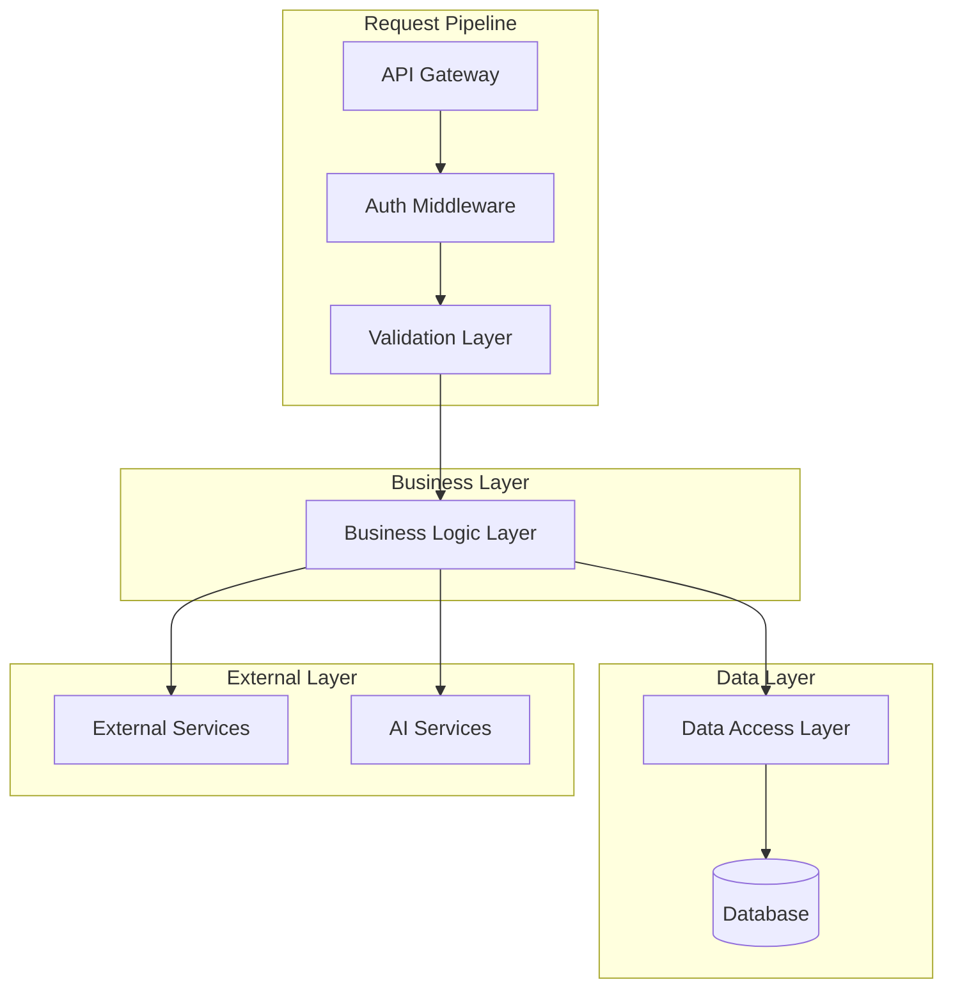
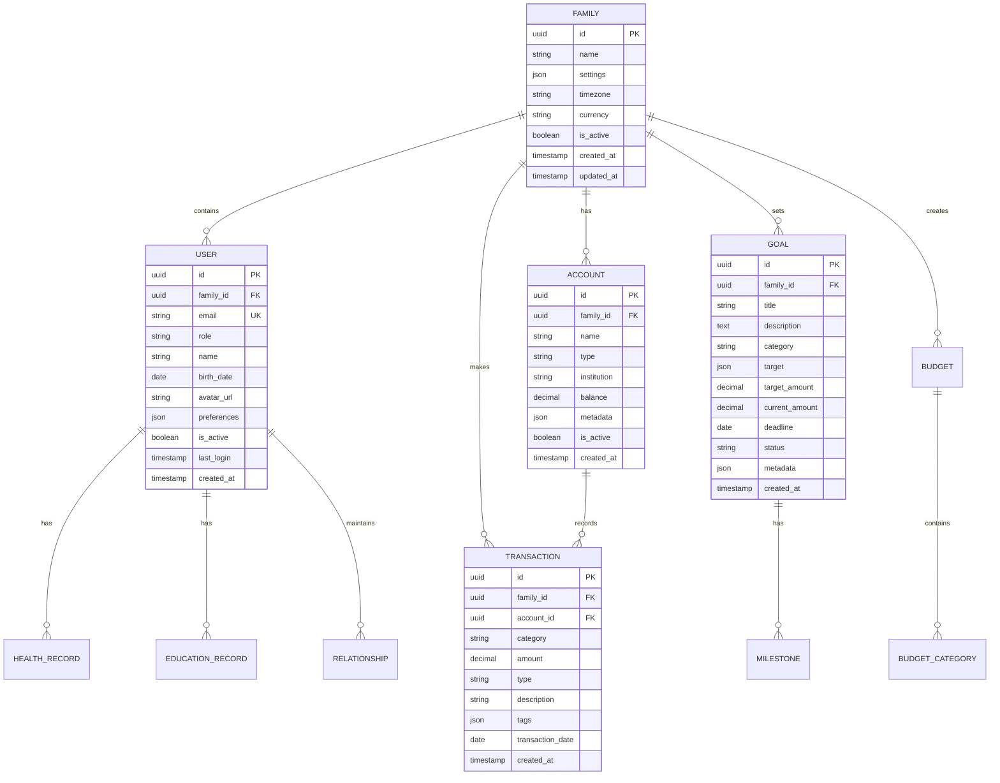

# Family Inc. OS - 技术架构文档

## 1. 架构设计

### 1.1 整体架构图

```mermaid
graph TD
    A[User Browser] --> B[Next.js Frontend]
    B --> C[Vercel Edge Functions]
    C --> D[Supabase Database]
    C --> E[Vercel AI SDK]
    E --> F[OpenAI GPT-4]
    C --> G[External APIs]
    
    subgraph "Frontend Layer"
        B
    end
    
    subgraph "Edge Computing Layer"
        C
        E
    end
    
    subgraph "Data Layer"
        D
    end
    
    subgraph "AI Services"
        F
    end
    
    subgraph "External Services"
        G
    end
```

**架构说明**:
- **前端层**: Next.js App Router提供SSR/SSG能力，优化首屏性能
- **边缘计算层**: Vercel Edge Functions实现全球低延迟API响应
- **数据层**: Supabase提供PostgreSQL数据库、认证、实时订阅
- **AI服务层**: Vercel AI SDK简化LLM集成，支持流式响应
- **外部服务**: 银行API、保险API、教育API等第三方集成

### 1.2 微服务架构

```mermaid
graph TD
    A[API Gateway] --> B[Auth Service]
    A --> C[Finance Service]
    A --> D[Growth Service]
    A --> E[Health Service]
    A --> F[Relationship Service]
    A --> G[AI Advisor Service]
    
    B --> H[Supabase Auth]
    C --> I[Database]
    D --> I
    E --> I
    F --> I
    G --> J[AI Models]
    
    subgraph "Core Services"
        B
        C
        D
        E
        F
        G
    end
```

## 2. 技术描述

### 2.1 核心技术栈

**前端技术**:
- Next.js 14.0+ (App Router)
- TypeScript 5.0+
- Tailwind CSS 3.4+
- React Hook Form 7.x
- TanStack Query 5.x
- Zustand 4.x (状态管理)

**UI/可视化**:
- Headless UI (组件库)
- Recharts 2.x (图表库)
- Framer Motion 11.x (动画)
- React Calendar (日历组件)

**后端技术**:
- Vercel Edge Functions
- Supabase (PostgreSQL 15+)
- Prisma 5.x (ORM)
- Zod 3.x (数据验证)

**AI/ML技术**:
- Vercel AI SDK 3.x
- OpenAI GPT-4 Turbo
- LangChain.js (AI工作流)
- TensorFlow.js (客户端ML)

**开发工具**:
- Vite (构建工具)
- ESLint + Prettier (代码规范)
- Husky + lint-staged (Git hooks)
- Playwright (E2E测试)
- Jest + Testing Library (单元测试)

### 2.2 技术选型理由

**背景**: 家庭管理应用需要处理敏感的财务和健康数据，要求高安全性、实时性和可扩展性。

**约束条件**:
- 快速迭代开发需求
- 数据隐私和安全合规要求
- 复杂的业务逻辑处理
- AI功能集成复杂度
- 多平台兼容性

**解决方案分析**:
- **Next.js App Router**: 内置SSR/SSG，优化SEO和性能
- **TypeScript**: 类型安全，减少运行时错误
- **Supabase**: 一站式后端服务，内置认证和实时功能
- **Edge Functions**: 全球分布式部署，降低延迟
- **Vercel AI SDK**: 简化LLM集成，支持流式响应

## 3. 路由定义

### 3.1 前端路由结构

| 路由路径 | 页面组件 | 权限要求 | 功能描述 |
|----------|----------|----------|----------|
| `/` | LandingPage | 公开 | 产品介绍和注册入口 |
| `/auth/login` | LoginPage | 公开 | 用户登录 |
| `/auth/register` | RegisterPage | 公开 | 用户注册 |
| `/dashboard` | DashboardPage | 认证用户 | 家庭仪表板 |
| `/finance` | FinanceLayout | 认证用户 | 财务中心 |
| `/finance/overview` | FinanceOverview | 认证用户 | 财务概览 |
| `/finance/accounts` | AccountList | 认证用户 | 账户管理 |
| `/finance/budget` | BudgetPage | 认证用户 | 预算管理 |
| `/finance/goals` | GoalsPage | 认证用户 | 目标规划 |
| `/finance/reports` | ReportsPage | 认证用户 | 财务报表 |
| `/growth` | GrowthLayout | 认证用户 | 成长中心 |
| `/growth/education` | EducationPage | 认证用户 | 教育规划 |
| `/growth/career` | CareerPage | 认证用户 | 职业规划 |
| `/growth/okr` | OkrPage | 认证用户 | OKR管理 |
| `/health` | HealthLayout | 认证用户 | 健康中心 |
| `/health/overview` | HealthOverview | 认证用户 | 健康概览 |
| `/health/records` | HealthRecords | 认证用户 | 健康档案 |
| `/health/insurance` | InsurancePage | 认证用户 | 保险管理 |
| `/health/plans` | HealthPlans | 认证用户 | 健康计划 |
| `/relationships` | RelationsLayout | 认证用户 | 关系管理 |
| `/relationships/family` | FamilyRelations | 认证用户 | 家庭关系 |
| `/relationships/events` | EventsPage | 认证用户 | 事件管理 |
| `/relationships/calendar` | CalendarPage | 认证用户 | 家庭日历 |
| `/advisor` | AdvisorLayout | 认证用户 | AI顾问 |
| `/advisor/dashboard` | AdvisorDashboard | 认证用户 | AI仪表板 |
| `/advisor/chat` | ChatPage | 认证用户 | AI对话 |
| `/advisor/reports` | AdvisorReports | 认证用户 | AI分析报告 |
| `/settings` | SettingsLayout | 认证用户 | 设置中心 |
| `/settings/profile` | ProfileSettings | 认证用户 | 个人设置 |
| `/settings/family` | FamilySettings | 家庭管理员 | 家庭设置 |
| `/settings/security` | SecuritySettings | 认证用户 | 安全设置 |

### 3.2 API路由结构

```
api/
├── auth/
│   ├── login.ts
│   ├── logout.ts
│   ├── register.ts
│   └── refresh.ts
├── finance/
│   ├── transactions.ts
│   ├── accounts.ts
│   ├── budgets.ts
│   ├── goals.ts
│   └── reports.ts
├── growth/
│   ├── education.ts
│   ├── career.ts
│   └── okr.ts
├── health/
│   ├── records.ts
│   ├── insurance.ts
│   └── plans.ts
├── relationships/
│   ├── family.ts
│   ├── events.ts
│   └── calendar.ts
├── advisor/
│   ├── chat.ts
│   ├── analysis.ts
│   └── recommendations.ts
└── webhook/
    ├── bank-sync.ts
    └── notifications.ts
```

## 4. API定义

### 4.1 认证相关API

#### 用户注册
```
POST /api/auth/register
```

**请求参数**:
```typescript
interface RegisterRequest {
  email: string
  password: string
  name: string
  phone?: string
  familyName: string
  invitationCode?: string
}
```

**响应数据**:
```typescript
interface RegisterResponse {
  success: boolean
  data: {
    user: User
    family: Family
    token: string
    refreshToken: string
  }
  message?: string
}
```

#### 用户登录
```
POST /api/auth/login
```

**请求参数**:
```typescript
interface LoginRequest {
  email: string
  password: string
  rememberMe?: boolean
}
```

### 4.2 财务相关API

#### 获取交易记录
```
GET /api/finance/transactions
```

**查询参数**:
```typescript
interface TransactionQuery {
  page?: number
  limit?: number
  category?: string
  startDate?: string
  endDate?: string
  accountId?: string
}
```

**响应数据**:
```typescript
interface TransactionResponse {
  success: boolean
  data: {
    transactions: Transaction[]
    pagination: {
      page: number
      limit: number
      total: number
      pages: number
    }
    summary: {
      income: number
      expense: number
      balance: number
    }
  }
}
```

#### 创建交易记录
```
POST /api/finance/transactions
```

**请求体**:
```typescript
interface CreateTransactionRequest {
  amount: number
  category: string
  description: string
  accountId: string
  type: 'income' | 'expense'
  date: string
  tags?: string[]
  attachments?: string[]
}
```

### 4.3 AI顾问API

#### 智能对话
```
POST /api/advisor/chat
```

**请求体**:
```typescript
interface ChatRequest {
  message: string
  context?: {
    topic?: string
    previousMessages?: Message[]
    familyData?: Partial<FamilyData>
  }
  stream?: boolean
}
```

**流式响应**:
```typescript
interface ChatStreamResponse {
  type: 'chunk' | 'complete' | 'error'
  data?: string
  message?: string
  metadata?: {
    tokens: number
    model: string
    cost: number
  }
}
```

#### 生成分析报告
```
POST /api/advisor/analysis
```

**请求体**:
```typescript
interface AnalysisRequest {
  type: 'financial' | 'health' | 'education' | 'relationship'
  period: 'month' | 'quarter' | 'year'
  familyId: string
  options?: {
    includeRecommendations?: boolean
    includePredictions?: boolean
    riskAssessment?: boolean
  }
}
```

## 5. 服务器架构

### 5.1 服务分层架构



### 5.2 核心服务组件

**认证服务 (Auth Service)**:
```typescript
interface AuthService {
  validateToken(token: string): Promise<User>
  generateTokens(user: User): Promise<TokenPair>
  refreshToken(refreshToken: string): Promise<TokenPair>
  revokeToken(token: string): Promise<void>
}
```

**财务服务 (Finance Service)**:
```typescript
interface FinanceService {
  createTransaction(data: TransactionData): Promise<Transaction>
  getTransactions(query: TransactionQuery): Promise<PaginatedResult<Transaction>>
  analyzeSpending(familyId: string, period: Period): Promise<SpendingAnalysis>
  generateBudget(familyId: string): Promise<BudgetRecommendation>
}
```

**AI顾问服务 (AI Advisor Service)**:
```typescript
interface AIAdvisorService {
  chat(message: string, context: ChatContext): Promise<AIResponse>
  analyzeFamily(familyId: string, type: AnalysisType): Promise<AnalysisReport>
  generateRecommendations(familyId: string): Promise<Recommendation[]>
  predictTrends(familyId: string, metric: string): Promise<TrendPrediction>
}
```

## 6. 数据模型

### 6.1 核心实体关系图



### 6.2 数据表定义

#### 家庭表 (families)
```sql
CREATE TABLE families (
    id UUID PRIMARY KEY DEFAULT gen_random_uuid(),
    name VARCHAR(255) NOT NULL,
    settings JSONB DEFAULT '{}',
    timezone VARCHAR(50) DEFAULT 'Asia/Shanghai',
    currency VARCHAR(3) DEFAULT 'CNY',
    is_active BOOLEAN DEFAULT true,
    created_at TIMESTAMP WITH TIME ZONE DEFAULT NOW(),
    updated_at TIMESTAMP WITH TIME ZONE DEFAULT NOW()
);

CREATE INDEX idx_families_active ON families(is_active);
CREATE INDEX idx_families_created_at ON families(created_at DESC);
```

#### 用户表 (users)
```sql
CREATE TABLE users (
    id UUID PRIMARY KEY DEFAULT gen_random_uuid(),
    family_id UUID NOT NULL REFERENCES families(id) ON DELETE CASCADE,
    email VARCHAR(255) UNIQUE NOT NULL,
    role VARCHAR(50) NOT NULL CHECK (role IN ('admin', 'parent', 'child', 'guest')),
    name VARCHAR(255) NOT NULL,
    birth_date DATE,
    avatar_url TEXT,
    preferences JSONB DEFAULT '{}',
    is_active BOOLEAN DEFAULT true,
    last_login TIMESTAMP WITH TIME ZONE,
    created_at TIMESTAMP WITH TIME ZONE DEFAULT NOW(),
    updated_at TIMESTAMP WITH TIME ZONE DEFAULT NOW()
);

CREATE INDEX idx_users_family_id ON users(family_id);
CREATE INDEX idx_users_email ON users(email);
CREATE INDEX idx_users_active ON users(is_active);
```

#### 交易表 (transactions)
```sql
CREATE TABLE transactions (
    id UUID PRIMARY KEY DEFAULT gen_random_uuid(),
    family_id UUID NOT NULL REFERENCES families(id) ON DELETE CASCADE,
    account_id UUID NOT NULL REFERENCES accounts(id) ON DELETE CASCADE,
    category VARCHAR(100) NOT NULL,
    amount DECIMAL(15,2) NOT NULL CHECK (amount != 0),
    type VARCHAR(20) NOT NULL CHECK (type IN ('income', 'expense', 'transfer')),
    description TEXT,
    tags JSONB DEFAULT '[]',
    transaction_date DATE NOT NULL,
    metadata JSONB DEFAULT '{}',
    created_at TIMESTAMP WITH TIME ZONE DEFAULT NOW(),
    updated_at TIMESTAMP WITH TIME ZONE DEFAULT NOW()
);

CREATE INDEX idx_transactions_family_id ON transactions(family_id);
CREATE INDEX idx_transactions_account_id ON transactions(account_id);
CREATE INDEX idx_transactions_date ON transactions(transaction_date);
CREATE INDEX idx_transactions_category ON transactions(category);
```

### 6.3 初始数据设置

#### 默认分类数据
```sql
INSERT INTO transaction_categories (family_id, name, type, icon, color, is_system) VALUES
    (NULL, '工资收入', 'income', 'briefcase', '#10B981', true),
    (NULL, '投资收益', 'income', 'trending-up', '#10B981', true),
    (NULL, '餐饮支出', 'expense', 'utensils', '#EF4444', true),
    (NULL, '交通支出', 'expense', 'car', '#EF4444', true),
    (NULL, '住房支出', 'expense', 'home', '#EF4444', true),
    (NULL, '教育支出', 'expense', 'graduation-cap', '#8B5CF6', true),
    (NULL, '医疗支出', 'expense', 'heart', '#F59E0B', true),
    (NULL, '保险支出', 'expense', 'shield', '#3B82F6', true);
```

#### 权限配置
```sql
-- 基本权限设置
GRANT SELECT ON ALL TABLES IN SCHEMA public TO anon;
GRANT ALL PRIVILEGES ON ALL TABLES IN SCHEMA public TO authenticated;

-- RLS (Row Level Security) 策略
ALTER TABLE families ENABLE ROW LEVEL SECURITY;
ALTER TABLE users ENABLE ROW LEVEL SECURITY;
ALTER TABLE transactions ENABLE ROW LEVEL SECURITY;

-- 家庭数据访问策略
CREATE POLICY "Users can view their family data" ON families
    FOR SELECT USING (
        EXISTS (
            SELECT 1 FROM users 
            WHERE users.family_id = families.id 
            AND users.email = auth.email()
        )
    );

-- 用户数据访问策略
CREATE POLICY "Users can view their own data" ON users
    FOR SELECT USING (
        email = auth.email() OR 
        EXISTS (
            SELECT 1 FROM families 
            WHERE families.id = users.family_id
            AND EXISTS (
                SELECT 1 FROM users u2 
                WHERE u2.family_id = families.id 
                AND u2.email = auth.email()
            )
        )
    );
```

## 7. 性能优化策略

### 7.1 数据库优化

**索引策略**:
- 为频繁查询的字段创建复合索引
- 使用部分索引优化特定查询
- 定期分析和更新统计信息

**查询优化**:
- 使用EXPLAIN分析查询计划
- 避免N+1查询问题
- 合理使用JOIN和子查询
- 实施数据分区策略

### 7.2 缓存策略

**多层缓存**:
- CDN缓存静态资源
- Redis缓存热点数据
- 应用层内存缓存
- 数据库查询缓存

**缓存失效**:
- 基于时间的失效策略
- 基于事件的失效机制
- 增量更新策略
- 缓存预热机制

### 7.3 前端优化

**代码分割**:
- 路由级别的代码分割
- 组件级别的懒加载
- 第三方库的按需加载
- 动态导入策略

**资源优化**:
- 图片压缩和格式优化
- 字体子集化
- CSS和JS的压缩合并
- 预加载关键资源

## 8. 安全设计

### 8.1 认证与授权

**多层认证**:
- JWT Token认证
- 刷新Token机制
- 多因素认证支持
- 设备指纹识别

**权限控制**:
- RBAC权限模型
- 数据级权限控制
- API级别权限验证
- 审计日志记录

### 8.2 数据保护

**加密策略**:
- 传输层TLS 1.3加密
- 存储层AES-256加密
- 敏感数据字段级加密
- 密钥管理服务

**隐私保护**:
- 数据最小化原则
- 用户同意机制
- 数据匿名化处理
- 定期数据清理

### 8.3 安全防护

**防护措施**:
- SQL注入防护
- XSS攻击防护
- CSRF攻击防护
- DDoS攻击防护
- API限流和熔断

**监控告警**:
- 异常行为检测
- 安全事件响应
- 漏洞扫描机制
- 定期安全审计

这个技术架构文档为Family Inc. OS提供了完整的技术实现方案，涵盖了系统架构、数据模型、API设计、性能优化和安全防护等各个方面，为开发团队提供了详细的技术指导。